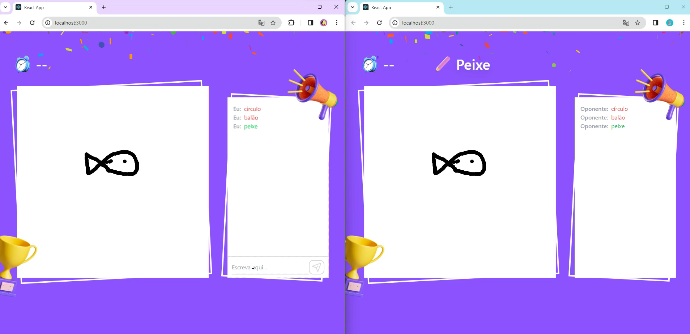

# Drawing Together 🖌

## Description
Game for two people playing together. A person needs to draw and another person needs to get it right.

## Features
- Timer Control
- Chat
- Allow Draw
- Generate Random Words
- Change round (for another to draw)
- Time Break
- Response Verification

## How Start this project
- Run "npm install"
- Go to "BackEnd" folder and run "npm run start"
- In another terminal, Go to "FrontEnd" folder and run "npm run start"
- For generating word it is necessary two browser tabs connected

## Technologies
- Backend: Node and ExpressJS
- FrontEnd: React and Tailwind
- Real time bidirectional communication: Socket.IO
- Allow board to Draw: P5

## Objective
I create this project to improve my bidirectional communication skills.